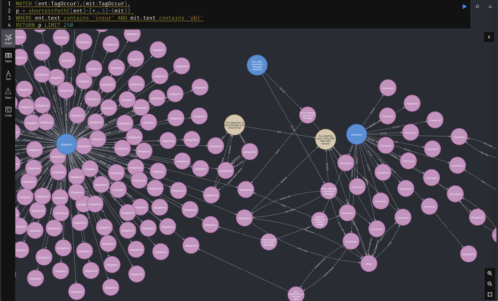
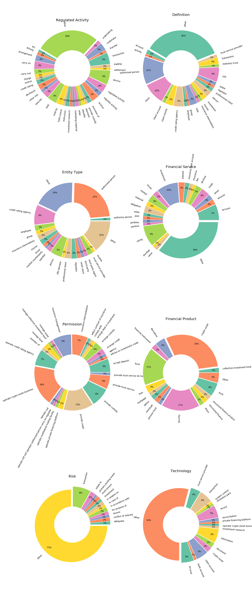

# Knowledge Graph of ADGM Regulations
Regulatory Knowledge Graph built in collaboration with Abu Dhabi Global Market.

# Introduction

In order to automate compliance and RegTech process we've designed an approach aimed to convert human-readable 
regulations into Regulation-As-A-Code: executable rules parsed from texts with the 
help of transformer based LM trained on NER task and relation extraction task. 
This allows us to support the Open World Assumption and have an extendable ontology.
Rules are extracted as a subgraph with GNN thus supplement inference with causality 
reasoning as follows:    

>If an ‘ENT’ with this ‘PERM’ was doing this ‘ACT’ or ‘FS’ with ‘PROD’ using ‘TECH’ then to avoid this ‘RISK’ they should ‘MIT’.

The project status:
1. Design the approach and initial taxonomy for labeling :white_check_mark:
2. Train models to extract entities for graph nodes. :white_check_mark:
3. Train models to extract relations for graph edges.
4. Train GNN for rules extraction

The project got inspiration from the DARPA's research around surveillance of the media field, where video 
and text feeds were parsed by ML to extract events, event's time, event's place, entities involved and 
other supplementary information and store that in the Knowledge DB for a downstream analysis.
Find more details on how it is applicable to the RegTech and compliance and more insights for higher 
level vision of the Knowledge Graph project [here in athe article at Linkedin](https://www.linkedin.com/pulse/unboxing-skynet-regulatory-compliance-vladimir-ershov/?trackingId=LtVM0rfPFtYOUjR2%2BF1c8w%3D%3D)

# Getting started

1. Download the data and checkout the instructions in the `./data/` folder. You may need lfs for that.
2. Open the Neo4j Browser and test one of the cypher queries.
3. You may check all the shortest path in the Regulatory Knowledge Graph between `insurance` and `obligation`:
    ```cypher
    MATCH (ent:TagOccur),(mit:TagOccur),
    p = shortestPath((ent)-[*..3]-(mit))
    WHERE ent.text contains 'insur' AND mit.text contains 'obl'
    RETURN p LIMIT 250
   ```
4. The result is interactive and should look like this:
   
5. Check more examples at `./reports/` folder

# Models and technologies used to extract current version of the graph  

[NeuralCoref](https://github.com/huggingface/neuralcoref) is used for coreference resolution. 

[Spacy](https://spacy.io) To train NER models for nodes creation and custom `lemmatizer`:

Bert-based NER                                    | Labeled Docs FPR 
---------------------------------------- |:-----------------:
ACT-FS-PROD           | 98.57/98.92/98.23 
TECH |  93.87/94/93.73  
RISK-MIT             | 51.71/47.02/57.43 
PERM   |   93.64/91.01/96.43 
ENT | 99.45/99.34/99.56

POS-Regexp based models                                    | Size | Source
---------------------------------------- |:----:| :----------------:
DEF           | 370  | COBS labeled

There is a stub for relation extraction which is based on the combination of `Spacy` and `NetworkX`

[Neo4J](https://neo4j.com) is used for graph storage with APOC extension, cypher execution and visualisations


# What has been released in this repository?
1. Knowledge graph for ADGM regulations in the `./data` folder, which consist of:

      | "Nodes"         |"value.count"|
      -------------|:-----------------:
      | "Document"  |26           |
      | "Paragraph" |22027        |
      | "Tag"       |35498        |
      | "TagOccur"  |173853       |

   | "Relations"      |"value.count"|
   ----------|:-----------------:
   | "NEXT"   |37381        |
   | "INSIDE" |22027        |
   | "OCCUR"  |173853       |
   | "SOURCE" |186693       |
   | "REL"    |789253       | 

2. Reports to showcase various topics coverage by regulatory documents in the ./reports folder:

3. Example cypher queries to try in the [Reports Readme](./reports/README.md)

# FAQ
TBD

# Disclaimer

# Contact information

