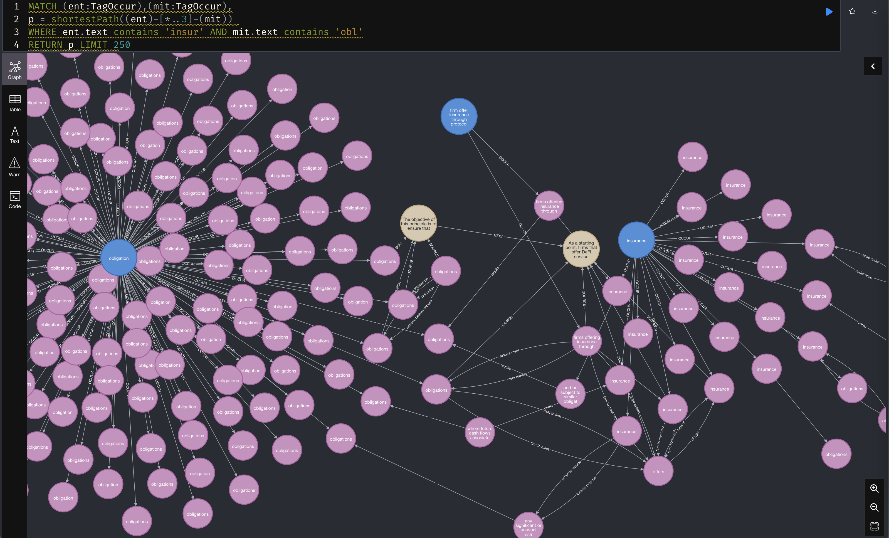

# Knowledge Graph of ADGM Regulations
Regulatory Knowledge Graph built in collaboration with Abu Dhabi Global Market.
Here are presented reports for amount of tags in the documents, co-occurrences of most common entities and 
report on covered products in each of the document.  

# Cypher queries

### Get counters for amount of detected entities
```cypher
MATCH (t:Tag) RETURN DISTINCT (t.ttype), COUNT(*) as cnt ORDER BY cnt DESC
```

|"(t.ttype)"|"cnt"|
---: | :--- 
|"MIT"      |20488|
|"RISK"     |10736|
|"TECH"     |1961 |
|"ACT"      |653  |
|"FS"       |582  |
|"ENT"      |525  |
|"PERM"     |272  |
|"DEF"      |201  |
|"PROD"     |72   |

### Simple query to get table of content for AML related regulation
```cypher
MATCH p=(f)-[r:NEXT]->(t)--(d:Document)
WHERE f.plevel < 1 and t.plevel < 1 and d.title contains 'AML'
RETURN t LIMIT 2500
```


### Using graph structure to explore relations between concept

```cypher
MATCH (ent:TagOccur),(mit:TagOccur),
p = shortestPath((ent)-[*..3]-(mit))
WHERE ent.text contains 'insur' AND mit.text contains 'obl'
RETURN p LIMIT 250
```


### Intersecting two documents by common products

```cypher
Match (n:Tag)
where n.ttype = 'PROD'
MATCH occur_left=(n)-[r_o_l:OCCUR]->(left:TagOccur)
MATCH src_left=(left)-[r_s_l:SOURCE]->(p_left)--(d_left:Document)
where d_left.title contains '(COBS)'
MATCH occur_right=(n)-[r_o_r:OCCUR]->(right:TagOccur)
MATCH src_right=(right)-[r_s_r:SOURCE]->(p_right)--(d_right:Document)
WHERE d_right.title contains '(AML)'
RETURN occur_left, occur_right, src_right, src_left,d_left, d_right LIMIT 25000
```


